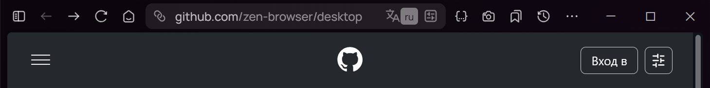
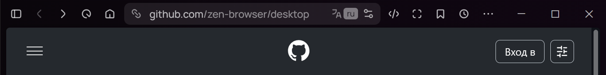
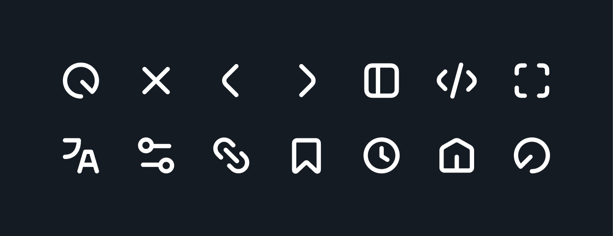

# New toolbar icons
New icons for the toolbar and better locale button. I did it in one evening, so it will still be updated. Enjoy using it😏 Write to me if you want me to change any icons that you want

### Before

### After

### All changed icons

### List of changed icons
- Zen toggle compact mode
- Back
- Forward
- Reload
- Stop
- Home
- Developer
- Screenshot
- Bookmarks menu
- History panel menu
- Urlbar
- Translations
- Translations (loading)
- Site data
- Nav bar overflow
